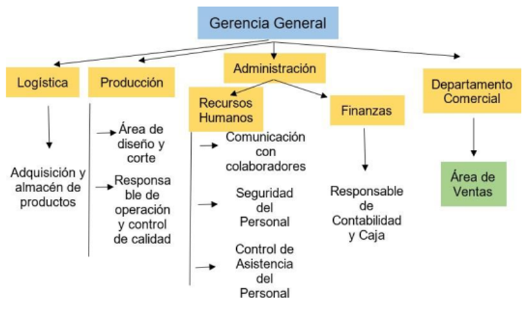
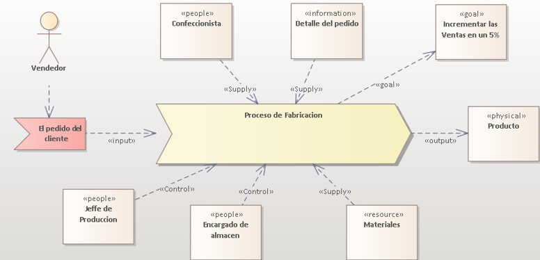
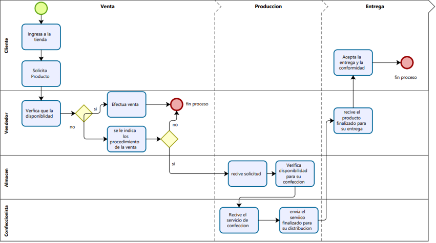
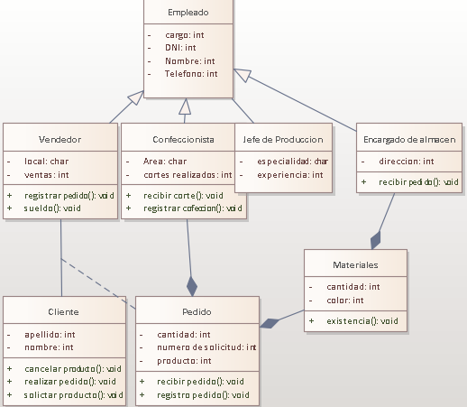

## **Datos de la Empresa**

* Razon Social : Creaciones y Confecciones
* Ruc : 100786745010 
* Direccion : 
* Tiempo de Actividad: 4 años
* Inicio : 21/09/2018
* Inscripcion : 21/09/2018
* Estado : Activo 

## **Reseña Historica**
El negocio a tenido un inicio de manera informal con una idea de querer independizarse y tener una nueva forma de generar ingresos y la necesidad económica que se vivía en esos momentos y como en ese entonces se veía que era algo rentable la compra y venta de ropas es por eso que se comenzó de esa manera y es así como fue empezando este proyecto que como todos en un inicio a tenido sus momentos gloriosos y otros desafortunados pero la constancia y la fe de querer progresar, y es así como de a poco ya se fue dejando la idea de solo comprar ropas sino también fabricarlas y venderlas es por eso que se fue adquiriendo máquinas de poco a poco y trabajándolas con poco conocimiento del manejo de ellas pero con la práctica se fue dominando, y con la moral en alta se fue desarrollando el negocio que ahora, de tener que vender de forma ambulatoria ahora ya contamos con una tienda y las ventas ya nos son por minoría sino, ventas por mayor apoyando a otros emprendedores que negocian con la compra y venta de ropas.

## **Situación Problemática**
En base a los cambios de tecnología no hay que se ajenos a estos cambios continuos, es por ende que enfatizamos este trabajo en una propuesta de un desarrollo de software para el negocio, ya que se ve evidenciado que no tienen un control de sus ventas y de su producción, ocasionando perdidas en el negocio, ya que por ahora solo vienen trabajando con  técnicas pasadas como el manejos de agendas, cuadernos de apuntes entre otros, es por eso que vamos a tecnificar los procesos para tener como resultado mayor eficiencia  mayor control del stock, producción y ventas.
Los problemas que se pudo evidenciar en las ventas es, que para cantidades grandes no hay un stock suficiente indicándole al cliente plazos extremadamente largos de espera para su entrega, ya que el vendedor realiza una solicitud de confesión al area encargada de producción, y esta área se encuentra saturada en producir otros modelos no se venden por queno llevan un control eficiente de los productos mas demandados.

## **Documentacion**
### **Organigrama**

## **Identificacion de Proceso de Negocio**
### **Diagrama de Erikson Penker**

### **Diagrama de Actividades**

## **Identificacion de Caso de Dominio**

