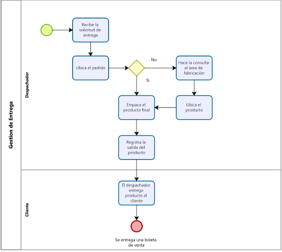
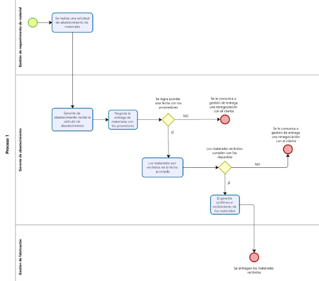
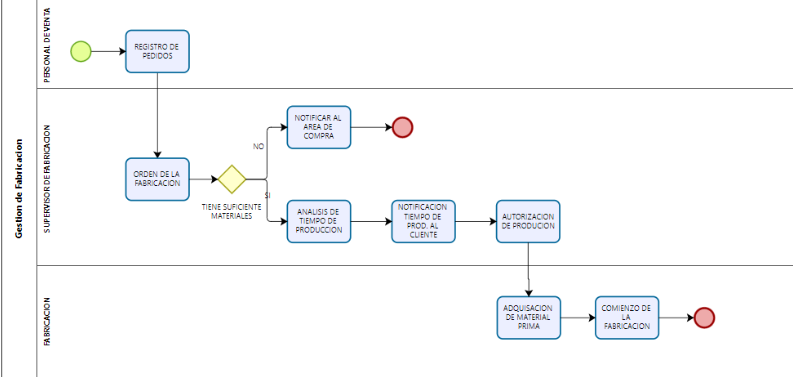
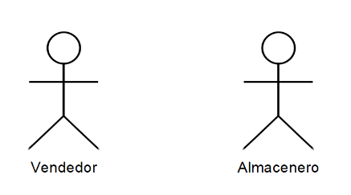
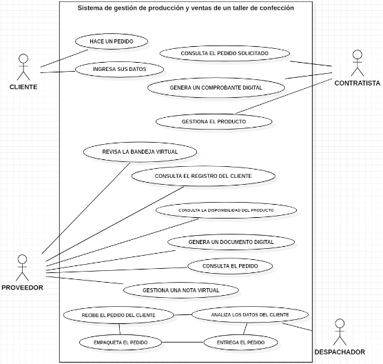

# **DOCUMENTACION DEL PROYECTO**

## **FACULTAD DE INGENIERIA Y ARQUITECTURA**

## **ESCUELA DE IGENIERIA DE SISTEMAS**

## **PROYECTO DE ANALISIS Y DISEÑO DE SISTEMAS**

# Software Sistema de gestión de producción y ventas de un taller de confección **Lolita**

### **Docente** 
#### BERROCAL NAVARRO, RICHARD LEONARDO ORCID: 0000-0001-8718-3150
#
### **Equipo**
 #### Gonzalo Valdez Luis Miguel
 #### Mendoza De la Cruz Miguel Jhonatan
 #### Gracia Llaguento, Juan Pedro
 #### Perez Granados, Juan Diego 
 #### Diaz González Jefferson Anthony
 #### Giovanni Amadeo Cuba Flores
 #
 #### **LIMA - PERU**
 #### **2022**
#

### **PORCENTAJE DE TRABAJO DEL EQUIPO**

| INTEGRANTES | PRIMER INFORME | SEGUNDO INFORME | INFORME FINAL
---|:---:|:---:|:---:
Gonzalo Valdez Luis Miguel | 100% | 100%
Mendoza De la Cruz Miguel Jhonatan | 100% | 100%
Gracia Llaguento, Juan Pedro | 100% | 0%
Perez Granados, Juan Diego | 100% | 100%
Diaz González Jefferson Anthony | 100% | 100%
Giovanni Amadeo Cuba Flores | 100% | 100%
#

## **INDICE**

[RESUMEN EJECUTIVO](./README.md#resumen-ejecutivo)

[INTRODUCCION](./README.md#introduccion)

[1. ESTUDIO DE FACTIBILIDAD](./README.md#1-estudio-de-factibilidad)

[1.1Factibilidad operativa y técnica: La visión del sistema](./README.md#11factibilidad-operativa-y-técnica-la-visión-del-sistema)

[2. MODELO DE NEGOCIO](./README.md#2-modelo-de-negocio)

[2.1. MODELO DE CASO DE USO DEL NEGOCIO](./README.md#21-modelo-de-caso-de-uso-del-negocio)

[2.1.1. LISTA DE LOS ACTORES DEL NEGOCIO](./README.md#211-lista-de-los-actores-del-negocio)

[2.1.2. LISTA DE LOS CASOS DE USO DEL NEGOCIO](./README.md#212-lista-de-casos-de-uso-del-negocio)

[2.1.3. DIAGRAMA DE CASOS DE USO DEL NEGOCIO](./README.md#213-diagrama-de-casos-de-uso-del-negocio)

[2.1.4. ESPECIFICACIONES DE CASOS DE USO DEL NEGOCIO](./README.md#214-especificaciones-de-casos-de-uso-del-negocio)

[2.2. MODELO DE ANÃLISIS DEL NEGOCIO](./README.md#22-modelo-de-análisis-del-negocio)

[2.2.1. LISTA DE TRABAJADORES DE NEGOCIO](./README.md#221-lista-de-trabajadores-de-negocio)

[2.2.2. LISTA DE ENTIDADES DE NEGOCIO](./README.md#222-lista-de-entidades-de-negocio)

[2.2.3. REALIZACION DE CASOS DE USO DEL NEGOCIO](#223-realización-de-casos-de-uso-del-negocio)

[2.2.4. DIAGRAMA DE ACTIVIDADES](#225-realización-de-clases-de-dominio)

[2.2.5. REALIZACION DE CLASES DE DOMINIO](#225-realización-de-clases-de-dominio)

[2.3. GLOSARIO DE TERMINOS](./README.md#23-glosario-de-términos)

[2.4. REGLAS DE NEGOCIO](./README.md#24-reglas-de-negocio)

[3. CAPTURA DE REQUERIMIENTOS](./README.md#3-captura-de-requerimientos)

[3.1. Fuentes de obtención de requerimiento](./README.md#31fuentes-de-obtención-de-requerimientos)

[3.1.1. INFORME DE ENTREVISTAS O MATERIAL TÉCNICO](./README.md#311-informe-de-entrevistas-o-material-técnico)

[3.1.2. MATRIZ DE ACTIVIDADES Y REQUERIMIENTOS](./README.md#312-matriz-de-actividades-y-requerimientos)

[3.2. MODELO DE CASOS DE USO](./README.md#32-modelo-de-casos-de-uso)

[3.2.1. LISTA DE ACTORES DEL SISTEMA](./README.md#321-lista-de-actores-del-sistema)

[3.2.2. LISTA DE CASOS DE USO DEL SISTEMA](./README.md#322-lista-de-casos-de-uso-del-sistema)

[3.2.3. LISTA DE CASOS DE USO PRIORIZADOS](./README.md#323-lista-de-casos-de-uso-priorizados)

[3.2.4. DIAGRAMAS DE CASO DE USO DEL SISTEMA](./README.md#324-diagramas-de-caso-de-uso-del-sistema)

[3.2.5. ESPECIFICACIONES DE REQUERIMIENTOS DE SOFTWARE](./README.md#325-especificaciones-de-requerimientos-de-software)

[3.2.6. ESPECIFICACIONES DE CASOS DE USO](./README.md#326-especificaciones-de-casos-de-uso)

## Resumen Ejecutivo

**¿En qué consiste el proyecto?**
El proyecto consiste en  una aplicación para la gestión de producción y venta de prendas de vestir , esta aplicación servirá para anotar los datos de producción y las ventas de los productos. , es muy fácil de utilizar.
**¿Quienes somos?**
Los miembros del equipo que han diseñado esta aplicación son los siguientes:
-Cuba Flores Giovanni Amadeo
-Diaz González Jefferson Anthony
-Gonzalo Valdez Luis Miguel
-Gracia Llaguento, Juan Pedro
-Perez Granados, Juan Diego
-Mendoza De la Cruz Miguel Jhonatan
## **Introduccion**

Con la dinámica actual del mercado y los constantes cambios del ambiente competitivo, Se a plantado el  desarrollo de una aplicación para la gestión de producción y venta de prendas de vestir-gestión de producción y ventas de un taller de confección “lolita”. Es fácil de utilizar la cual estará dirigida a LOLITA y las pequeñas empresas textiles  que usan la manera antigua de llevar los datos de  su producción y venta de sus productos, la aplicación ayudará a optimizar el tiempo y llevar los datos de producción y venta.
## **1. Estudio de Factibilidad**

Este estudio ayuda a un análisis específico o más claro de la economía y la forma viable de la inversión es por ello que obtiene el nombre de estudio de factibilidad o viabilidad.
Así mismo poder desarrollar un aplicativo donde esté enfocado a rubro textil para a si lograr ayudar a la productiva de negocios informales ya que en l mercado no hay aplicaciones similares lo cual es viable pues no existe mucha competencia y lograr captar mas establecimientos del rubro textil.

### 1.1Factibilidad operativa y técnica: La visión del sistema

Buscamos ser los creadores de oportunidades y facilitar el emprendimiento   de las mini empresas enfocadas al rubro textil ya que nuestro proyecto es innovador y beneficioso para todos aquellos que busquen un impulso, ayuda, ventaja estratégica para su negocio

## **2. Modelo De Negocio**

En el Negocio a investigar consta de dos procesos una de ellas es la producción de prendas que se ejecuta en base a la oferta y a la demanda de los productos con el fin de mantener abastecido al punto de venta en este caso seria una tienda de Cercado de Lima, el segundo proceso consta en la venta de estos productos ya sea por unidad o por mayor con la finalidad de llevar una gestión correcta de las ventas y tener un análisis de los productos más demandados, ya que el vendedor puedo efectuar la veta al por mayor como por unidad. 

### **2.1 Modelo de Caso de Uso del Negocio**

#### **2.1.1. Lista de los Actores del Negocio**

|Nombre        |   Descripcion|
|-------------|-------------|
|Cliente|Trabajadores externos para la fabricación del producto|
|Proveedor|Agente externo que provee de material para la fabricación.|
|Contratistas|Agente Externo que solicita los productos|

#### **2.1.2. Lista de Casos de Uso del Negocio**

|Nombre        |   Descripcion|
|-------------|-------------|
|Gestión de Pedido|Área en la que se ingresa el pedidoo|
|Gestión de Requerimiento de material|Área en la que verifica el material si no la hay suficiente se procede a solicitarlo|
|Gestión de abastecimiento|Área que se encarga de abastecer con material al negocio|
|Gestión de Fabricación|Área que se encargar del corte y la distribución a las service|
|Gestión de Entrega|Área que se encarga de entregar los pedidos al cliente|

#### **2.1.3. Diagrama de Casos de Uso del Negocio**

#### **2.1.4. Especificaciones de Casos de uso del Negocio**
##### **ECU Gestion de Pedido**
##### **Especificaiones de Alto Nivel**
|Nombre        |   Gestión de Pedido|
|-------------|-------------|
|Descripción|Este proceso comienza cuando con el cliente solicitando una cierta cantidad de prendas, si la cantidad de prendas solicitada está dentro del stock de la tienda se procede con la venta en caso contrario se procede a realizar una orden de pedido con un plazo mínimo de días para la entrega.|
|Actores de negocio|Vendedor, Cliente|
|Entradas|Ingreso de solicitud de pedido|
|Entregables|Entrega del pedido del cliente|
|Mejoras |Satisfacer la Necesidades de los clientes|

##### **Especificación de detalle nivel**

|NOMBRE DEL CASO DE USO        |   Gestión de Pedido|
|-------------|-------------|
|ACTOR |Vendedor, Cliente|
|OBJETIVO|Satisfacer la Necesidades de los clientes|
|BREVE DESCRIPCION|Este proceso tiene como finalidad aumentar las ventas y fidelizar a los clientes|
|PRECONDICIONES|La venta debe de ser mayor a 100 prendas  El requerimiento mínimo debe de ser 50 prendas Se debe efectuar el pago total por la cantidad del stock en tienda + un 10% de lo faltante|
|FLUJO BASICO DE EVENTOS |    1. El vendedor recibe el requerimiento del cliente 2. El vendedor ingresa los datos del cliente 3. El vendedor informa sobre los plazos de entrega 4. El vendedor registra el pedido del cliente 5. Fin del proceso|
|FLUJO ALTERNO|1. El vendedor verifica el stock en tienda. 1.1 Si hay stock en tienda se va al paso 3 2. El vendedor disuade al cliente con otros modelos en caso no haya en tienda 2.1 Si el cliente no acepta se va al paso 3 3. Si el vendedor no está conforme con los plazos de entrega se va al paso 5|
|POSTCONDICIONES|Se le entrega una boleta de pedido.|

##### **DA Gestion de Pedido**

##### **ECU Gestión de Entrega**

##### **Especificaiones de Alto Nivel**

|Nombre        |   Gestión de Entrega|
|-------------|-------------|
|Descripción|Este proceso se realiza cuando el pedido del cliente haya terminado la gestión de abastecimiento, por siguiente se busca el producto solicitado para ser empaquetado y finalmente entregado al cliente.|
|Actores de negocio|Despachador, Cliente|
|Entradas|Ingreso de solicitud de entrega|
|Entregables|Entrega del pedido del cliente|
|Mejoras |Satisfacer la Necesidades de los clientes|

##### **Especificación de detalle nivel**

|NOMBRE DEL CASO DE USO        |   Gestión de Entrega|
|-------------|-------------|
|ACTOR |Despachador, Cliente|
|OBJETIVO|Satisfacer la Necesidades de los clientes|
|BREVE DESCRIPCION|Este proceso tiene como finalidad aumentar las ventas y fidelizar a los clientes|
|PRECONDICIONES|La venta debe de ser mayor a 100 prendas El requerimiento mínimo debe de ser 50 prendas Se debe efectuar el pago total por la cantidad del stock en tienda + un 10% de lo faltante|
|FLUJO BASICO DE EVENTOS |    1.  El despachador recibe la solicitud de entrega 2. El despachador ubica el pedido 3. El despachador empaca el producto final 4. El despachador registra la salida del producto 5. El despachador entrega el producto al cliente 6.  Fin del proceso|
|FLUJO ALTERNO| -El despachador ubica el producto. En caso no ubique el producto debe de realizar la consulta al area de fabricación.  El despachador ubica el producto|
|POSTCONDICIONES|Se le entrega una boleta de pedido.|
##### **DA Gestion de Entrega**

##### **ECU Gestión de Abastecimiento**
##### **Especificaiones de Alto Nivel**
|Nombre        |   Gestión de Abastecimiento|
|-------------|-------------|
|Descripción|Este proceso comienza cuando con la solicitud de requerimiento de material para la fabricación del pedido del cliente, se procede a contactar con los proveedores y planear una fecha de entrega de la materia prima para posteriormente recibir esta misma y pasar a gestión de fabricación.|
|Actores de negocio|Proveedores, Gerente de Abastecimiento|
|Entradas|Ingreso de solicitud de materiales de fabricación.|
|Entregables|Entrega de los materiales de fabricación.|
|Mejoras |Ser eficiente con la negociación de precios y fechas de entrega de los proveedores.|

##### **Especificación de detalle nivel**

|NOMBRE DEL CASO DE USO        |   Gestión de Abastecimiento|
|-------------|-------------|
|ACTOR |Proveedores, Gerente de Abastecimiento|
|OBJETIVO|Ser eficiente con la negociación de precios y fechas de entrega de los proveedores.|
|BREVE DESCRIPCION|Este proceso tiene como finalidad el abastecimiento de materia prima para la fabricación de los pedidos de los clientes|
|PRECONDICIONES|Gestión de requerimiento de materiales envía una solicitud de abastecimiento El inventario es verificado para confirmar que no se cuenta con los materiales necesarios para la fabricación del pedido|
|FLUJO BASICO DE EVENTOS |1.El gerente de abastecimiento recibe la solicitud de requerimiento de materiales 2. El gerente de abastecimiento negocia la entrega de los materiales con los proveedores 3. Los materiales son recibidos en la fecha acordada por almacén 4. El vendedor confirma el abastecimiento de materiales 5. Fin del proceso |
|FLUJO ALTERNO|2.1 Si no se llega a un acuerdo con los proveedores se le comunica a gestión de entrega para una renegociación con el cliente  4.1 Si los materiales recibidos no cumplen con los requisitos se negocia un nuevo abastecimiento y se le comunica a gestión de entrega |
|POSTCONDICIONES|Se entregan los materiales solicitados a gestión de fabricación|

##### **DA Gestion de Fabricacion**

##### **ECU Gestión de Fabricacion**

##### **Especificaiones de Alto Nivel**

|Nombre        |   Gestion de Fabricacion|
|-------------|-------------|
|Descripción|Este proceso se realiza la fabricación de los diseños de los productos y proceso, la planificación y el mantenimiento de las máquinas.|
|Actores de negocio|Supervisor de producción,personal|
|Entradas|Ingreso del material solicitado.|
|Entregables|Productos ya terminado.|
|Mejoras |Ser mas eficientes a la fabricación de los diseños de los productos.|

##### **Especificación de detalle nivel**

|NOMBRE DEL CASO DE USO        |   Gestion de Fabricacion|
|-------------|-------------|
|ACTOR |Supervisor de fabricación,personal|
|OBJETIVO|llegar al objetivo de producción con buena calidad.|
|BREVE DESCRIPCION|Este proceso tiene como finalidad  la fabricación de los diferentes diseños de los productos|
|PRECONDICIONES|La fabricación  debe de ser mayor a 120-Para la fabricación debe ser como mínimo 70 prendas-debe entregarse dentro del periodo de tiempo|
|FLUJO BASICO DE EVENTOS |1. El supervisor realiza los pedidos de los materiales  2. El encargado de las máquinas de inicio  3. El en personal da el diseño al producto  4. El personal da por finalizado la producción |
|FLUJO ALTERNO|Si no se llega a cumplir con el objetivo de producciónproduccion se comunica con el área de  entrega para realizar un plazo de tiempo para poder llegar al objetivo de fabricacion |
|POSTCONDICIONES|se realiza entrega al área de entrega|

##### **DA Gestion de Fabricacion**

### **2.2. Modelo de Análisis del Negocio**
#### **2.2.1. Lista de Trabajadores de Negocio**

|Nombre                     |Descripcion                                                                            |
|---------------------------|---------------------------------------------------------------------------------------|
|Vendedor                   |Trabajador del negocio que se encarga de gestionar el pedido del cliente.              |
|Encargado de finanzas      |Trabajador que se encarga de la gestión de compra de materiales para la producción.    |
|Encargado de producción    |Trabajadores que se encargan de realizar a fabricación de las prendas.                 |
|Encargado de calidad       |Trabajadores que se encargar de verificar que toda la prenda tenga un buen acabado.    |
|Encargado de distribución  |Trabajadores que se encargan de distribución ye entrega de los pedidos y los servicios.|

#### **2.2.2. Lista de Entidades de Negocio**

**Origen:** I=Interna, generada por el propio negocio, E=Externa, generada externamente y usada por el negocio como dato o medio de comunicación; **Tipo:** P=Persistente, que almacena datos, F=Formulario o documento impreso

|Nombre    |Descripcion                                                            |Origuen|Tipo|
|----------|-----------------------------------------------------------------------|-------|----|
|producto  |Instrumento de comercialización                                        |I      |P   |
|cliente   |Persona que se                                                         |E      |P   |
|Empleado  |Trabajadores que se encargan de realizar a fabricación de las prendas. |I      |P   |
|Pedido    |Acto que realiza el cliente y que el empleado recibe para su ejecución.|E      |F   |
|Proveedor |Agente externo al negocio que provee de materiales.                    |E      |F   |
|Servicise |Agente externo que el requerimiento del negocio.                       |E      |P   |

#### **2.2.2. Lista de Entidades de Negocio**

* RCUN -1: Gestión de Pedido.
* RCUN -2: Gestión de Requerimiento de material.
* RCUN -3: Gestión de abastecimiento.
* RCUN -4: Gestión de Fabricación.
* RCUN -5: Gestión de Entrega.

### **2.3. Glosario de términos**

|Nombre          |Descripcion                                                                                                             |
|----------------|------------------------------------------------------------------------------------------------------------------------|
**A**                                                                                                                                     |
|Análisis        |Es el proceso de dividir un tema complejo o sustancia en partes más pequeñas para obtener una mejor comprensión de él|
|**C**                                                                                                                                    |
|Contratista     |Trabajadores que se encargar de verificar que toda la prenda tenga un buen acabado.                                     |
|**D**                                                                                                                                    |
|Demanda         |Es una petición o solicitud de algo, especialmente si consiste en una exigencia o se considera un derecho.               |
|**E**                                                                                                                                    |
|Entregables     |Es el término entregable es utilizado en la gestión de proyectos para describir un objeto, tangible o intangible, como resultado del proyecto.|
|**M**                                                                                                                                    |
|MCUN            |Es el modelo de casos de uso de negocio describe los procesos de negocio de una empresa en términos de casos de uso del negocio y actores del negocio|
|**O**                                                                                                                                    |
|Oferta          |Es el Ofrecimiento para hacer o cumplir una cosa.                                                                       |
|**P**                                                                                                                                    |
|Procesos        |Es el Conjunto de fases sucesivas de un fenómeno o hecho complejo.                                                      |
|Precondiciones  |Una precondición es una condición que ha de satisfacerse justo antes del comienzo de la ejecución de una porción de código.|
|Postcondiciones |Una postcondición es una condición o predicado lógico que siempre debe cumplirse justamente después de la ejecución de una sección de código o de una operación.|

### **2.4. Reglas de negocio**

|Codigo|Nombre|Descripcion|Caso de Uso|
|------|------|-----------|-----------|
|      |      |           |           |

## **3. Captura de Requerimientos**

### **3.1.Fuentes de obtención de requerimientos**

#### **3.1.1. Informe de entrevistas o material técnico**

Nombre de  del proyecto gestión de producción y ventas de un taller de confección.En la entrevista realizada al dueño del taller tiene como objetivo recolectar información para los requerimientos para la gestión de su producción

Responda segun sea conveniente para usted las siguientes preguntas

1.¿Qué proceso realiza manualmente que necesiten que se automaticen?

* Registro de la materia prima
* Registro de la cantidad de los productos realizados
* Registro de productos dañados
* Registro de productos salidos a venta

2.¿que necesita que el sistema realice ?

* realizar un listado de la cantidad de materia prima ingreso en el mes
* un listado de los productos realizados
* listado de los productos dañados

3.¿que beneficios cree usted que obtendría al automatizar los procesos mencionados?

Generalmente los procesos mencionados requieren tiempo ya que se realiza de manera manual pero si estos procesos se automatizan se podrá realizar las entregas de los productos de manera mas rápida y a tiempo a su vez también obtendremos todos los listados detallado de los materiales.

#### **3.1.2. Matriz de Actividades y Requerimientos**

Procesos del negocio | Actividad del negocio | Responsables del negocio | Requerimiento | Casos de uso del sistema | Actores del sistema
---|---|---|---|---|---
Registra Ventas | El cliente realiza un Pedido Al vendedor | Cliente | Necesisto que el sistema perimita registrar la sesion del vendedor | CUS1_Logeo del vendedor | AS1_Vendedor
...| El revisa el stok de pedido | Vendedor | RF-002 Necesisto que el sistema perimita ver el estado del los productos  | CUS2_Mostrar estado del poducto | AS2_Almacenero
...| En caso que exista el pedido se vende  |...| RF-003 Necesisto que el sistema  envie y  actualize el stock | CUS3_Actualizar producto |...
...| Entrega un ticket con la fecha de la cita |...| RF-004 Necesisto que el sistema registre las los datos del cliente | CUS4_Registrar cliente |...
...|En caso que no exista se registra un pedido |...| RF-005 Necesisto que el sistema registre la venta y registre pedidos | CUS5_Registrar venta |...
...|Se entrega un boleta de venta o pedido|...| RF-006 Necesisto que el sistema genere una boleta | CUS6_Generar Boletas |...

### **3.2. Modelo de Casos de Uso**

#### **3.2.1. Lista de Actores del Sistema**

Lista de actores del sistema | |
---|---
Nombre | Descripcion
AS1_Vendedor | Agente que interactúa en el sistema, este es un experto en la gestión comercial de la empresa y es quien realiza la acción de vender, es decir, acerca al cliente los productos o servicios que la empresa ofrece para que sean comprados a cambio del pago de un precio
AS2_Almacenero | Agente que interactúa en el sistema, es el encargado de recibir los materiales y mercancías distribuidas en las dependencias del almacén; despacha los pedidos, registra en los libros el movimiento durante la jornada y redacta los partes de entrada y salida

#### **3.2.2. Lista de Casos de Uso del Sistema**

Lista de Casos de Uso del Sistema | |
---|---
Nombre | Descripcion
CC01 Logeo de vendedor | El sistema autentifica al usuario y contraseña ingresados por el dueño del taller
CC02 Mostrar estado del producto | el sistema verifica cada producto realizado y terminado si esta en buen estado o no  por lo contrario pasara a los productos en mal estado
CC03 Actualizar producto | el sistema volverá a los productos en mal estado o dañados de nuevo a la producción de tal manera que se corrijan los productos
CC04 Registrar cliente | el sistema registrara alos clientes y sus  pedidos te tal manera que les de una fecha de entrea de los productos pedidos
CC05 Registrar venta  | el sistema una vez terminado los productos se realizara la entrega de los productos alos clientes
CC06 Generar boleta | el sitema al termino de cada venta  realizara una boleta detallando todos los productos que se entregaran

#### **3.2.3. Lista de Casos de Uso priorizados**

Priorizacion de casos de uso del sistema | | | | | | |
---|---|:---:|:---:|:---:|:---:|:---:|
 | | | 0,4 | 0,3 | 0,2 | 0,1
**Actor** | **Caso de uso** | Complejidad | Precedencia | Premura | Riesgo | Total
AS1_Vendedor | CC01_Logeo del vendedor   |x | | | |0,4
AS2_Almacenero | CC02_Mostrar estado del producto | |x | | |0,3
AS2_Almacenero | CC03_Actualizar producto | |x | | |0,3
AS1_Vendedor | CC04_Registrar cliente | |x | | |0,3
AS1_Vendedor | CC05_Registrar venta | |x | | |0,3
AS1_Vendedor | CC06_Generar Boletas|x | | | |0,4
 |  | | | | | |1,2

#### **3.2.4. Diagramas de Caso de Uso del Sistema**

#### **3.2.5. ESPECIFICACIONES DE REQUERIMIENTOS DE SOFTWARE**

**Requerimientos Funcionales**

* El sistema verificará la identidad del vendedor al iniciar la session
* El Sistema permitirá ver una lista del stock disponible de cada producto
* El sistema permitirá filtrar los datos de los diferentes productos para analizar su disponibilidad
* El sistema mostrará un mensaje si al momento de seleccionar el producto no se encuentra disponible a falta de stock
* El sistema permitirá registrar, actualizar, eliminar los datos de:

  * Clientes
  * Ventas
  * Pedidos
  * Vendedores
* El sistema permitirá generar una boleta en formato pdf de cada venta realizada.
* El sistema controlará los accesos y solo permitirá el ingreso de usuarios autorizados.

**Requerimientos no Funcionales**

* Debe ser fácil de usar, con ayuda e interfaces intuitivas.
* El ingreso al sistema estará restringido con contraseñas cifradas y usuarios definidos.
* El sistema deberá funcionar en distintos tipos de sistemas operativos y plataformas de hardware.
* El sistema debe soportar el manejo de gran cantidad de información durante su proceso.
* El sistema debe proporcionar mensajes de error que sean informativos y orientados al usuario final.
* El sistema no podrá ocupar más de 1 Gb de espacio en el disco.

#### **3.2.6. ESPECIFICACIONES DE CASOS DE USO**

Nombre | CU1_Logear al vendedor
---|---
Tipo | Primario
Autor | Juan Diego Perez
Actores | AS1_Vendedor
Iteracion |
CU Relacionado | CU2_Mostrar estado del producto
Breve Descripción | Permite identificar y validar las credenciales del vendedor, permitiendo el ingreso al sistema
Flujo basico | El actor ingresa su usuario y contraseña El actor selecciona la opción iniciar sesión El sistema valida las credenciales en la base de datos El sistema muestra el catálogo de productos con sus respectivas disponibilidades
Flujo Alternativo | Las credenciales del actor no existe Error al ingresar el usuario o contraseña
Pre condiciones | El actor debe estar registrado en el sistema
Post condiciones | Validación realizada con éxito

Nombre | CU2_Mostrar estado del producto
---|---
Tipo | Primario
Autor | Juan Diego Perez
Actores | AS1_Vendedor
Iteracion |
CU Relacionado | CU3_Actualizar Producto
Breve Descripción | Permite confirmar la disponibilidad de un producto a vender y solicitar su re-stock en caso no esté disponible
Flujo basico | El actor selecciona la opción de mostrar la lista de productos  El Sistema muestra la lista de productos que ofrece la tienda El actor selecciona la opción de mostrar detalles en el producto seleccionado  El sistema muestra la disponibilidad del producto seleccionado El vendedor confirma la disponibilidad del producto a vender
Flujo Alternativo | El producto seleccionado se encuentra fuera de stock El vendedor da click al botón de solicitor re-stock del producto El Sistema crea una solicitud de re-stock del producto para la sección de almacenamiento
Pre condiciones | El producto debe estar registrado en el sistema y tener su estado de disponibilidad actualizado
Post condiciones | Confirmación de disponibilidad del producto

Nombre | CU3_Actualizar Producto
---|---
Tipo | Primario
Autor | Juan Diego Perez
Actores | AS2_Almacenero
Iteracion |
CU Relacionado | CU2_Mostrar estado del producto
Breve Descripción | Permite actualizar el estado de disponibilidad del producto
Flujo basico | El actor recibe una notificación solicitando un re-stock de producto El actor realiza el proceso de re-stock del producto El actor selecciona la opción de mostrar la lista de productos El sistema muestra la lista de productos que ofrece la tienda El actor selecciona la opción de editar el estado del producto El actor escribe el nuevo estado del producto y selecciona confirmar El sistema actualiza el estado del producto
Flujo Alternativo | El producto requerido es imposible de reabastecer El actor da click en la opción de suspender la venta del producto El sistema oculta el producto de la lista de productos disponibles en la tienda
Pre condiciones | El producto debe estar registrado como fuera de stock y ser solicitado al actor
Post condiciones | Actualización del estado del producto

Nombre | CU4_Registrar Cliente
---|---
Tipo | Primario
Autor | Juan Diego Perez
Actores | AS1_Vendedor
Iteracion |
CU Relacionado | CU1_Logear al vendedor
Breve Descripción | Permite registrar nuevos clientes a la tienda
Flujo basico | El Actor despliega la ventana de clientes El actor selecciona la opción de nuevo cliente El actor ingresa los datos necesarios al formulario El actor selecciona la opción guardar El sistema registrará los datos del usuario a la base de datos El sistema muestra la lista de los usuarios
Flujo Alternativo | Los datos del cliente ya existe en el sistema Los datos del cliente no están completos
Pre condiciones | El actor debe estar logueado correctamente al sistema
Post condiciones | Registro realizado con éxito

Nombre | CU5_Registrar Venta
---|---
Tipo | Primario
Autor | Juan Diego Perez
Actores | AS1_Vendedor
Iteracion |
CU Relacionado | CU2_Mostrar estado del producto
Breve Descripción | Permite registrar nuevos ventas de la tienda
Flujo basico | El actor selecciona cada producto a vender El actor selecciona la opción de añadir al carrito en cada producto El actor despliega la ventana del carrito El actor selecciona la opción de realizar venta El actor ingresa los datos necesarios al formulario El actor selecciona la opción confirmar El sistema registrará los datos de la venta en la base de datos El sistema muestra la lista de las ventas
Flujo Alternativo | Los datos de la venta están incompletos
Pre condiciones | El actor y el cliente deben estar registrados en el sistema
Post condiciones | Registro realizado con éxito

Nombre | CU6_Generar Boleta
---|---
Tipo | Primario
Autor | Juan Diego Perez
Actores | AS2_Almacenero
Iteracion |
CU Relacionado | CU5_Registrar Venta
Breve Descripción | Permite generar una boleta de venta
Flujo basico | El Actor despliega la ventana ventas de la tienda El actor realiza el filtrado para hallar la venta El sistema muestra los detalles de la venta El actor selecciona la opción generar boleta El sistema exporta la boleta a pdf
Flujo Alternativo | Los datos de la venta están incompletos
Pre condiciones | El actor debe estar registrado en el sistema
Post condiciones | Boleta generada con éxito
