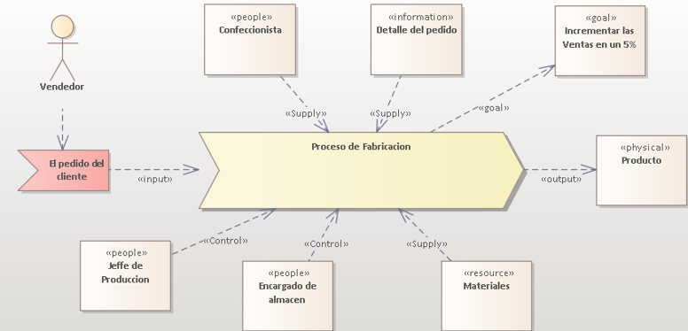
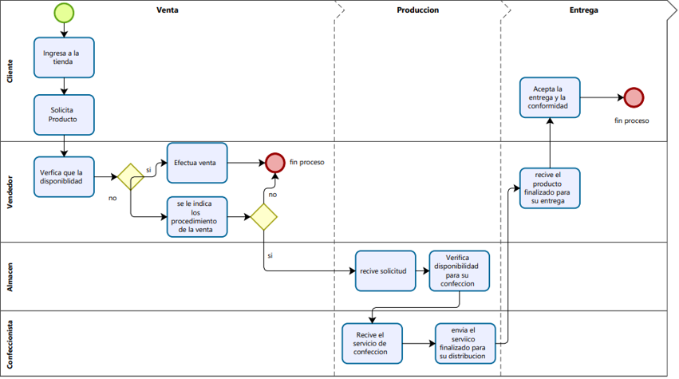
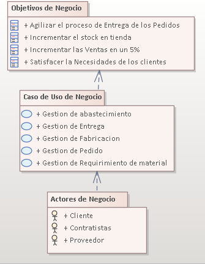
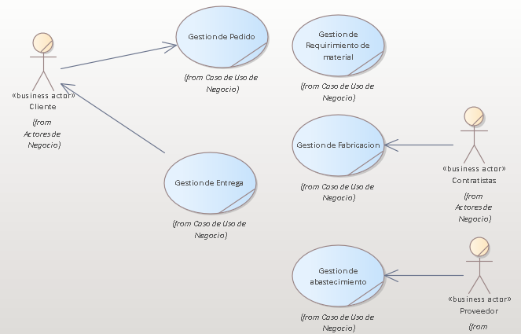
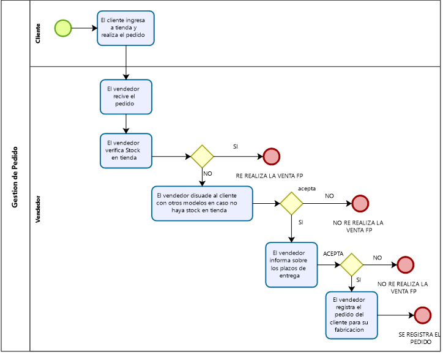
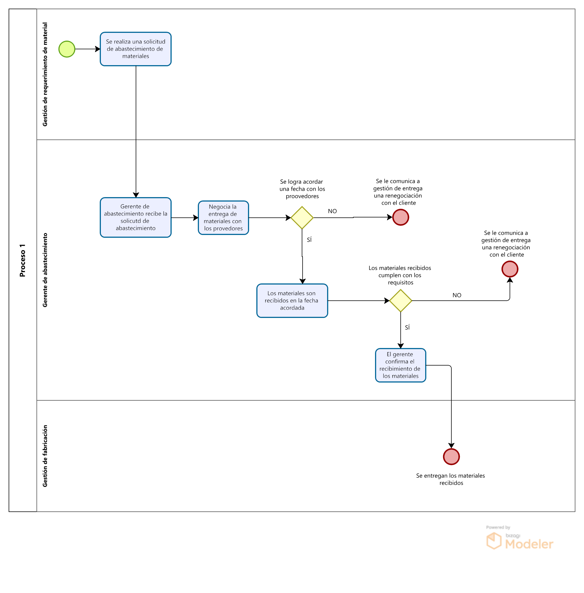
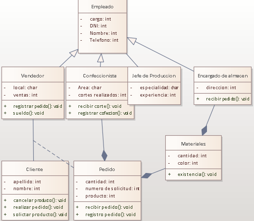
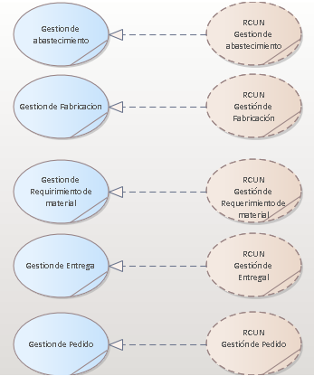

# **DOCUMENTACION DEL PROYECTO**

## **FACULTAD DE INGENIERIA Y ARQUITECTURA**

## **ESCUELA DE IGENIERÍA DE SISTEMAS**

## **PROYECTO DE ANALISIS Y DISEÑO DE SISTEMAS**

# Software Sistema de gestión de producción y ventas de un taller de confección **Lolita**

## Docente BERROCAL NAVARRO, RICHARD LEONARDO ORCID: 0000-0001-8718-3150

### Equipo
 #### Gonzalo Valdez Luis Miguel
 #### Mendoza De la Cruz Miguel Jhonatan
 #### Gracia Llaguento, Juan Pedro
 #### Diaz González Jefferson Anthony
 #### Giovanni Amadeo Cuba Flores

## 1.1 Resumen Ejecutivo

## 2. Modelo De Negocio
En el Negocio a investigar consta de dos procesos una de ellas es la producción de prendas que se ejecuta en base a la oferta y a la demanda de los productos con el fin de mantener abastecido al punto de venta en este caso seria una tienda de Cercado de Lima, el segundo proceso consta en la venta de estos productos ya sea por unidad o por mayor con la finalidad de llevar una gestión correcta de las ventas y tener un análisis de los productos más demandados, ya que el vendedor puedo efectuar la veta al por mayor como por unidad. 

### 2.1 Modelo de Caso de Uso del Negocio

#### 2.1.1. Lista de los Actores del Negocio

|Nombre        |   Descripcion|
|-------------|-------------|
|Cliente|Trabajadores externos para la fabricación del producto|
|Proveedor|Agente externo que provee de material para la fabricación.|
|Contratistas|Agente Externo que solicita los productos|

#### 2.1.2. Lista de Casos de Uso del Negocio

|Nombre        |   Descripcion|
|-------------|-------------|
|Gestión de Pedido|Área en la que se ingresa el pedidoo|
|Gestión de Requerimiento de material|Área en la que verifica el material si no la hay suficiente se procede a solicitarlo|
|Gestión de abastecimiento|Área que se encarga de abastecer con material al negocio|
|Gestión de Fabricación|Área que se encargar del corte y la distribución a las service|
|Gestión de Entrega|Área que se encarga de entregar los pedidos al cliente|

#### 2.1.3. Diagrama de Casos de Uso del Negocio

#### 2.1.4. Especificaciones de Casos de uso del Negocio
##### ECU Gestion de Pedido
###### Especificaiones de Alto Nivel
|Nombre        |   Gestión de Pedido|
|-------------|-------------|
|Descripción|Este proceso comienza cuando con el cliente solicitando una cierta cantidad de prendas, si la cantidad de prendas solicitada está dentro del stock de la tienda se procede con la venta en caso contrario se procede a realizar una orden de pedido con un plazo mínimo de días para la entrega.|
|Actores de negocio|Vendedor, Cliente|
|Entradas|Ingreso de solicitud de pedido|
|Entregables|Entrega del pedido del cliente|
|Mejoras |Satisfacer la Necesidades de los clientes|

###### Especificación de detalle nivel

|NOMBRE DEL CASO DE USO        |   Gestión de Pedido|
|-------------|-------------|
|ACTOR |Vendedor, Cliente|
|OBJETIVO|Satisfacer la Necesidades de los clientes|
|BREVE DESCRIPCION|Este proceso tiene como finalidad aumentar las ventas y fidelizar a los clientes|
|PRECONDICIONES|-La venta debe de ser mayor a 100 prendas -El requerimiento mínimo debe de ser 50 prendas-Se debe efectuar el pago total por la cantidad del stock en tienda + un 10% de lo faltante|
|FLUJO BASICO DE EVENTOS |    1. El vendedor recibe el requerimiento del cliente     2. El vendedor ingresa los datos del cliente     3. El vendedor informa sobre los plazos de entrega     4. El vendedor registra el pedido del cliente 5. Fin del proceso|
|FLUJO ALTERNO|1. El vendedor verifica el stock en tienda. 1.1 Si hay stock en tienda se va al paso 3 2. El vendedor disuade al cliente con otros modelos en caso no haya en tienda 2.1 Si el cliente no acepta se va al paso 3 3. Si el vendedor no está conforme con los plazos de entrega se va al paso 5|
|POSTCONDICIONES|Se le entrega una boleta de pedido.|

###### DA Gestion de Pedido

##### ECU Gestión de Entrega
###### Especificaiones de Alto Nivel
|Nombre        |   Gestión de Entrega|
|-------------|-------------|
|Descripción|Este proceso se realiza cuando el pedido del cliente haya terminado la gestión de abastecimiento, por siguiente se busca el producto solicitado para ser empaquetado y finalmente entregado al cliente.|
|Actores de negocio|Despachador, Cliente|
|Entradas|Ingreso de solicitud de entrega|
|Entregables|Entrega del pedido del cliente|
|Mejoras |Satisfacer la Necesidades de los clientes|

###### Especificación de detalle nivel

|NOMBRE DEL CASO DE USO        |   Gestión de Entrega|
|-------------|-------------|
|ACTOR |Despachador, Cliente|
|OBJETIVO|Satisfacer la Necesidades de los clientes|
|BREVE DESCRIPCION|Este proceso tiene como finalidad aumentar las ventas y fidelizar a los clientes|
|PRECONDICIONES|-La venta debe de ser mayor a 100 prendas -El requerimiento mínimo debe de ser 50 prendas-Se debe efectuar el pago total por la cantidad del stock en tienda + un 10% de lo faltante|
|FLUJO BASICO DE EVENTOS |    1.  El despachador recibe la solicitud de entrega     2. El despachador ubica el pedido     3. El despachador empaca el producto final     4. El despachador registra la salida del producto 5. El despachador entrega el producto al cliente 6.  Fin del proceso|
|FLUJO ALTERNO| -El despachador ubica el producto. En caso no ubique el producto debe de realizar la consulta al area de fabricación. El despachador ubica el producto|
|POSTCONDICIONES|Se le entrega una boleta de pedido.|
###### DA Gestion de Entrega

##### ECU Gestión de Abastecimiento
###### Especificaiones de Alto Nivel
|Nombre        |   Gestión de Abastecimiento|
|-------------|-------------|
|Descripción|Este proceso comienza cuando con la solicitud de requerimiento de material para la fabricación del pedido del cliente, se procede a contactar con los proveedores y planear una fecha de entrega de la materia prima para posteriormente recibir esta misma y pasar a gestión de fabricación.|
|Actores de negocio|Proveedores, Gerente de Abastecimiento|
|Entradas|Ingreso de solicitud de materiales de fabricación.|
|Entregables|Entrega de los materiales de fabricación.|
|Mejoras |Ser eficiente con la negociación de precios y fechas de entrega de los proveedores.|

###### Especificación de detalle nivel

|NOMBRE DEL CASO DE USO        |   Gestión de Abastecimiento|
|-------------|-------------|
|ACTOR |Proveedores, Gerente de Abastecimiento|
|OBJETIVO|Ser eficiente con la negociación de precios y fechas de entrega de los proveedores.|
|BREVE DESCRIPCION|Este proceso tiene como finalidad el abastecimiento de materia prima para la fabricación de los pedidos de los clientes|
|PRECONDICIONES|-Gestión de requerimiento de materiales envía una solicitud de abastecimiento -El inventario es verificado para confirmar que no se cuenta con los materiales necesarios para la fabricación del pedido|
|FLUJO BASICO DE EVENTOS |    1.   El gerente de abastecimiento recibe la solicitud de requerimiento de materiales 2. El gerente de abastecimiento negocia la entrega de los materiales con los proveedores 3. Los materiales son recibidos en la fecha acordada por almacén 4. El vendedor confirma el abastecimiento de materiales 5. Fin del proceso |
|FLUJO ALTERNO|2.1 Si no se llega a un acuerdo con los proveedores se le comunica a gestión de entrega para una renegociación con el cliente 4.1 Si los materiales recibidos no cumplen con los requisitos se negocia un nuevo abastecimiento y se le comunica a gestión de entrega |
|POSTCONDICIONES|Se entregan los materiales solicitados a gestión de fabricación|

###### DA Gestion de Abastecimiento

### 2.2. Modelo de Análisis del Negocio
#### 2.2.1. Lista de Trabajadores de Negocio

|Nombre                     |Descripcion                                                                            |
|---------------------------|---------------------------------------------------------------------------------------|
|Vendedor                   |Trabajador del negocio que se encarga de gestionar el pedido del cliente.              |
|Encargado de finanzas      |Trabajador que se encarga de la gestión de compra de materiales para la producción.    |
|Encargado de producción    |Trabajadores que se encargan de realizar a fabricación de las prendas.                 |
|Encargado de calidad       |Trabajadores que se encargar de verificar que toda la prenda tenga un buen acabado.    |
|Encargado de distribución  |Trabajadores que se encargan de distribución ye entrega de los pedidos y los servicios.|

#### 2.2.2. Lista de Entidades de Negocio

**Origen:** I=Interna, generada por el propio negocio, E=Externa, generada externamente y usada por el negocio como dato o medio de comunicación; **Tipo:** P=Persistente, que almacena datos, F=Formulario o documento impreso

|Nombre    |Descripcion                                                            |Origuen|Tipo|
|----------|-----------------------------------------------------------------------|-------|----|
|producto  |Instrumento de comercialización                                        |I      |P   |
|cliente   |Persona que se                                                         |E      |P   |
|Empleado  |Trabajadores que se encargan de realizar a fabricación de las prendas. |I      |P   |
|Pedido    |Acto que realiza el cliente y que el empleado recibe para su ejecución.|E      |F   |
|Proveedor |Agente externo al negocio que provee de materiales.                    |E      |F   |
|Servicise |Agente externo que el requerimiento del negocio.                       |E      |P   |

#### 2.2.2. Lista de Entidades de Negocio
* RCUN -1: Gestión de Pedido.
* RCUN -2: Gestión de Requerimiento de material.
* RCUN -3: Gestión de abastecimiento.
* RCUN -4: Gestión de Fabricación.
* RCUN -5: Gestión de Entrega.

### 2.3. Glosario de términos

|Nombre          |Descripcion                                                                                                             |
|----------------|------------------------------------------------------------------------------------------------------------------------|
**A**                                                                                                                                     |
|Análisis        |Es el proceso de dividir un tema complejo o sustancia en partes más pequeñas para obtener una mejor comprensión de él|
|**C**                                                                                                                                    |
|Contratista     |Trabajadores que se encargar de verificar que toda la prenda tenga un buen acabado.                                     |
|**D**                                                                                                                                    |
|Demanda         |Es una petición o solicitud de algo, especialmente si consiste en una exigencia o se considera un derecho.               |
|**E**                                                                                                                                    |
|Entregables     |Es el término entregable es utilizado en la gestión de proyectos para describir un objeto, tangible o intangible, como resultado del proyecto.|
|**M**                                                                                                                                    |
|MCUN            |Es el modelo de casos de uso de negocio describe los procesos de negocio de una empresa en términos de casos de uso del negocio y actores del negocio|
|**O**                                                                                                                                    |
|Oferta          |Es el Ofrecimiento para hacer o cumplir una cosa.                                                                       |
|**P**                                                                                                                                    |
|Procesos        |Es el Conjunto de fases sucesivas de un fenómeno o hecho complejo.                                                      |
|Precondiciones  |Una precondición es una condición que ha de satisfacerse justo antes del comienzo de la ejecución de una porción de código.|
|Postcondiciones |Una postcondición es una condición o predicado lógico que siempre debe cumplirse justamente después de la ejecución de una sección de código o de una operación.|

### 2.4. Reglas de negocio

|Codigo|Nombre|Descripcion|Caso de Uso|
|------|------|-----------|-----------|
|      |      |           |           |
