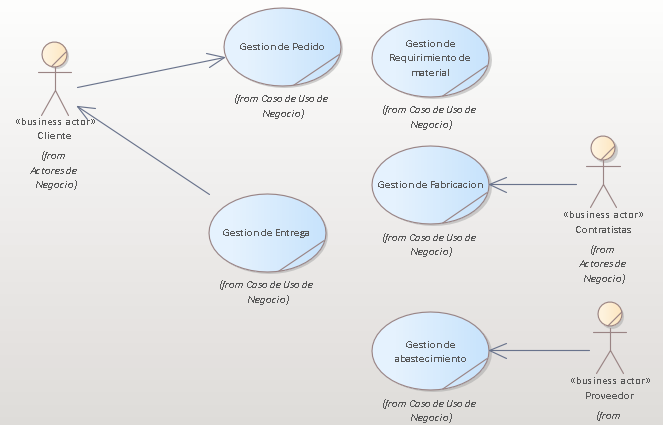

## 2. Modelo De Negocio
En el Negocio a investigar consta de dos procesos una de ellas es la producción de prendas que se ejecuta en base a la oferta y a la demanda de los productos con el fin de mantener abastecido al punto de venta en este caso seria una tienda de Cercado de Lima, el segundo proceso consta en la venta de estos productos ya sea por unidad o por mayor con la finalidad de llevar una gestión correcta de las ventas y tener un análisis de los productos más demandados, ya que el vendedor puedo efectuar la veta al por mayor como por unidad. 

### 2.1.1 Modelo de Caso de Uso del Negocio

#### 2.1.1. Lista de los Actores del Negocio

|Nombre        |   Descripcion|
|-------------|-------------|
|Cliente|Trabajadores externos para la fabricación del producto|
|Proveedor|Agente externo que provee de material para la fabricación.|
|Contratistas|Agente Externo que solicita los productos|

#### 2.1.2. Lista de Casos de Uso del Negocio

|Nombre        |   Descripcion|
|-------------|-------------|
|Gestión de Pedido|Área en la que se ingresa el pedidoo|
|Gestión de Requerimiento de material|Área en la que verifica el material si no la hay suficiente se procede a solicitarlo|
|Gestión de abastecimiento|Área que se encarga de abastecer con material al negocio|
|Gestión de Fabricación|Área que se encargar del corte y la distribución a las service|
|Gestión de Entrega|Área que se encarga de entregar los pedidos al cliente|

#### 2.1.3. Diagrama de Casos de Uso del Negocio

